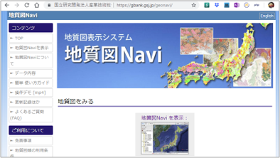

# 1-1. 地質図からわかること

## みなさんは地質図を見たことがありますか？

**地質図**は、地表の植生や表土、人工物を取り払って、地面の下にある岩石や地層がどのように分布しているかを描いた地図です。

[地質図Navi](https://gbank.gsj.jp/geonavi/geonavi.php)：日本では、産総研地質調査総合センターから配信される数多くの地質図データを、誰でもWebで閲覧することができるように整備されています。

## 地質図は何に役に立ちますか？

地質図は**地質時代**（人類が誕生するよりずっと前の時代）の土地の成り立ちを記載しています。そのため、地質図を見ると、「なぜそこに山があるのか」、「川がここを流れているのはなぜ」といった今見える風景に対する疑問に答えることができるようになります。また、大陸移動や日本列島がどのようにできたかなど、様々な地学研究のための基本的な資料となっています。 日本は地震、火山、津波、洪水、土砂崩れなど自然災害が大変多い国です。まちづくりや建物の建設などで災害対策（防災）を計画したり、避難計画を立てるうえでも、その土地の地質をよく知ることは大変重要です。

国の調査機関（[産総研地質調査総合センター](https://www.gsj.jp/)）では、20万分の1の縮尺で日本全国の地質を網羅していますが、5万分の1の縮尺の地質図は全国を網羅していません。より詳しい地質を知りたい場合は、地域の自治体や研究者、調査会社が作成したものを探すか、自分で作成する必要があります。

## 地質図はどうやって作っているのですか？

地質には、過去の地球上の事件（プレート移動や地震や火山などの地殻変動、風化・侵食・堆積などの地表の変動）が記録されています。事件が起こると現場検証を必ず行いますね。地質の研究でもそれは同様で、まずは事件現場に行って詳細に観察して推理すること（**野外調査**）が必要なのです。  
調査の方法は、考古学の遺跡調査に似ています。考古学の場合は人間の活動の記録を発掘してその謎をひも解いていきますが、地質学では人間ではなく地球の活動の記録をひも解いて、その成り立ちを地図上に記録していきます。  
このように、地質図の作成は、野外調査による実地の観察が基本となります。次章では、この野外調査（地表踏査）から地質図を作成する手順について解説します。  

