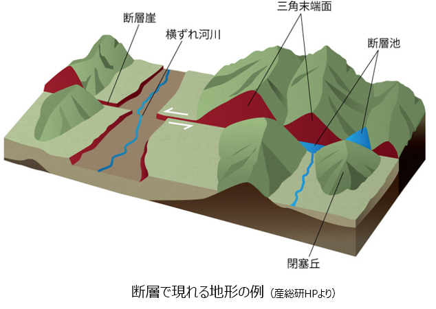

# 1-3-2. その他の調査・分析手法

地表踏査以外では以下のような測定・分析を行うことがあります。 露頭が少ない場所などでは、ボーリング調査などが必須になります。

## 物理探査

* **直接的な探査**：実際に地面に穴を掘って試料を採取する探査方法が**ボーリング探査**です。
* **間接的な探査**：間接的に地下の様子を探るのに利用される探査方法には、**地震波探査、音響探査、電磁探査**などがあります。

## 地形判読

地形は地下の地質の状況を反映していることが多いため、地形を把握することは、地表踏査を行う前の予備調査としても重要です。  
地形図、空中写真、衛星写真等を利用して、これら地形の特徴を読み取ることを**地形判読**といいます。

## その他の地図利用

土壌のもととなっている岩石（母岩）の種類によって、土壌の性質は異なっています。  
日本の土壌は、酸性岩がもとになっているものが多いのですが、蛇紋岩等の超塩基性岩が母岩となっている地域では、その他の地域と植生が異なっていることがあります。

[「地質図の作り方」に戻る](chapter01_3.md)
