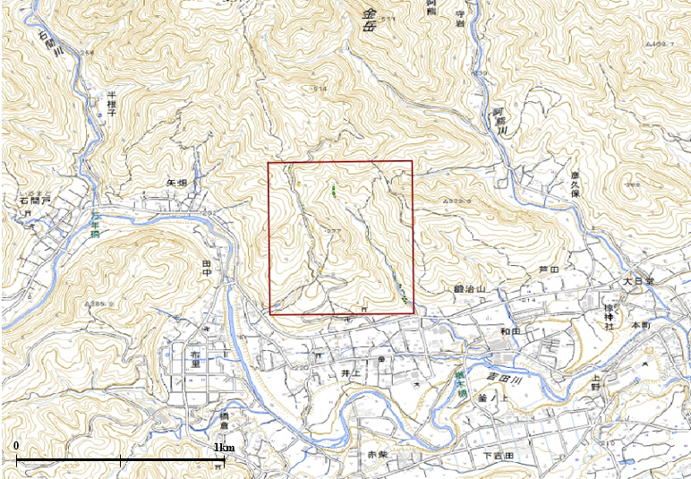

# 2. 地質図作成演習

では、さっそく地質図を作成してみましょう。 この演習では、すでに作成してあるルートマップをもとに、地質図学を用いて地質図を作成するところまでを行います。 作成する地域は、埼玉県秩父市吉田地区（図の赤線で囲った地域）で、秩父盆地北縁にあたります。

## 【演習内容】

この地域内にある東側の沢沿いと西側の林道沿いの２本のルートを調査して、下図のようなルートマップを作成しました。このルートマップをもとに、以下の手順で地質図を作図しましょう。

**【手順】** 1. 地層の境界での走向・傾斜は、地点A～Dの４か所で測定しています。  
このルートマップをもとに、A、B、C、Dの各地点の走向・傾斜を使用して、地質図学を用いて各地層ごとの境界線を書き入れていきましょう。 境界線の描画には、「作業用地図①～④」を使用します。  
（※不整合（玄武岩との境界）は既に赤点線で書き入れていますので、作図しなくてもよいです。）

1. ①～④で書き入れた境界線を「⑤作図用地図」に写し取り、岩相ごとに色をつけて地質図を完成させます。
2. ⑥、⑦は地質柱状図の描画です。余裕があればトライしてみましょう。  

※ 実際の作業は下記の「[演習用ワークシート](chapter02_5.md)」のPDFファイルをダウンロードして印刷したものに書きいれてください。

### 【演習用テキスト】

### [1. 調査の様子](chapter02_1.md)

### [2. 調査結果を記したルートマップ](chapter02_2.md)

### [3. 地質図学（１）　地層の走向・傾斜](chapter02_3.md)

* 走向の測定と表記のしかた
* 傾斜角と標高の関係

### [4.地質図学（２） 地質境界線を描画する](chapter02_4.md)

### [演習用ワークシート](chapter02_5.md) 　 [ [PDFファイル](演習_調査の様子.pdf) で表示]  

* ① 境界線作図用地図（１）
* ② 境界線作図用地図（２）
* ③ 境界線作図用地図（３）
* ④ 境界線作図用地図（４）
* ⑤作図用地図
* ⑥ 柱状図を作成する（１）― 西側林道沿いルート ―
* ⑦ 柱状図を作成する（２） ― 東側沢沿いルート ―

### [**解答例**](chapter02_6.md)　 [ [PDFファイル](演習_解答例.pdf) で表示]

* 境界線作図例
* 地質図作図例 
* 断面図・柱状図
* 調査結果をまとめる
* 立体図  

