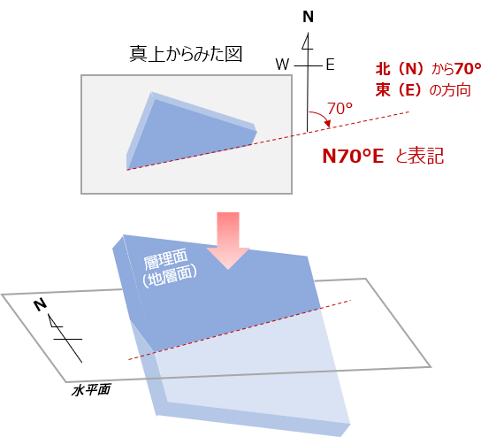

# 2-3. 地質図学（１）　地層の走向・傾斜を理解する

地質図を作成するには、地層の**走向・傾斜**を測定してルートマップに書き入れなければなりません。  
走向・傾斜の測定と表記は以下のように行います。

## 走向の測定と表記のしかた

実際の露頭での地層の走向・傾斜の測定は、間違えやすいので注意が必要です。

* 節理や片理が発達している岩石の場合は、層理面（堆積面）と間違えやすいので気を付けましょう。
* 露頭の形状により[**見掛けの傾斜**](chapter02_3_1.md)に騙されやすいので気を付けましょう。
* 下図のように、走向線は水平線との交線になります。クリノメータの水準器を利用して水平を保って測るようにしてください。
* 日本では、磁北と真北は数度ずれています（[**偏角**](chapter02_3_2.md)といいます）。地図に走向・傾斜を記入するときは補正して記入することを忘れないでください。
* 走向の表記は、下のように 北（N\)から、東（E\)または西（W\)に何度の方向というように表します。

  **N 〇〇°E（W）**

  
走向の表し方

## 傾斜角と標高の関係

地層が平面のまま分布しているとすると、ある露頭で観測された地層は走向線上では同じ標高のところに現れます。  
下の図の場合、A地点で見られた地層は、同じ標高のB地点でも現れます。では、B地点と同じ地層面にあり標高が10m高いC地点までの地図上の距離aはどのくらいあるでしょうか。

これは、上の図のように、傾斜角をもつ直角三角形を描き、その底辺の長さを図ることで知ることができます。  
次のページでは、この図法を利用した、地図上に地層の境界線を引く方法を解説します。

***  

[次（地質図学（２））へ](chapter02_4.md)

