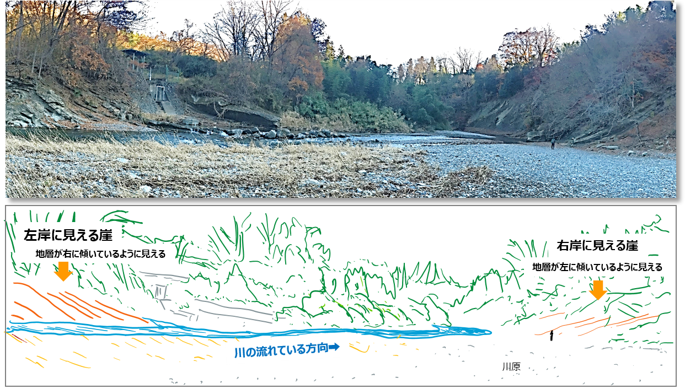

# 2-3-1. 見掛けの傾斜について

## 見掛けの傾斜に注意して観察しよう。

下図の写真は、川の上流から下流に向かって眺めた写真です。  
川原の両岸に露頭が見えますが、左岸では右に傾いた地層が見え、右岸では左に傾斜した地層が見えます。  
実際には地層はどのような走向・傾斜になっているのでしょうか？

  

***  

[「地質図学（１）」に戻る](chapter02_3.md)

