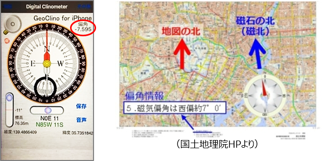
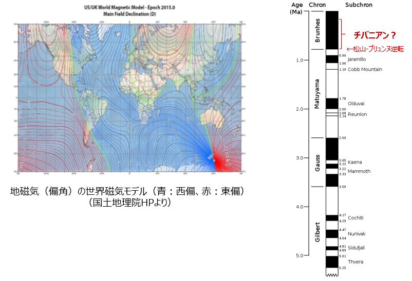

# 2-3-2. 偏角とは

方位磁針が北を指すのは、地球が磁場を持っているためです。この磁場を**地磁気**と言いますが、地球の極（自転軸）と地磁気の極は一致しないため、地図の北（真北）と方位磁石が指す北（磁北）は場所によって大きく変わります。  
このずれの角度のことを**偏角**といいます。  
クリノメータで測った走向などの方位を地図に記入するときは、偏角を考慮する必要があります。（2万5千分の1地形図には、その地域の偏角が記載されています）

## 変化する地磁気

地球の地磁気の原因は、内部中心核のダイナモ作用（磁場をもつ物質の流れに伴い発生した電流により磁界が発生する作用）によるものがほとんどで、数年から数百年のスケールで変化していきます。

### 【地磁気の逆転】

過去には地磁気が逆転していた（地磁気の南北が逆になっていた）が分かっています。  
この原因は、まだよくわかっていませんが、地層中の岩石にある残留磁気を調べることによって、いつの時代に地磁気が逆転していたかが明らかになってきました。 この成果を利用して、国際的に行われた深海掘削計画にてプレート移動の様子などを探ることができました。

ちなみに、最近話題の「チバニアン」は、過去に地磁気の逆転した時期の地質時代を表す名称として候補に挙げられています。  
千葉県にある地層では、地上で松山ーブリュンヌ境界の逆転が観察できる場所ということで、この境界より上位の約77万年前～約12万6千年前の地質時代を表す地層の模式地とするかどうか国際地質科学連合で審査が行われており、2019年中には決定される予定です。

***

[「地質図学（１）」に戻る](chapter02_3.md)

