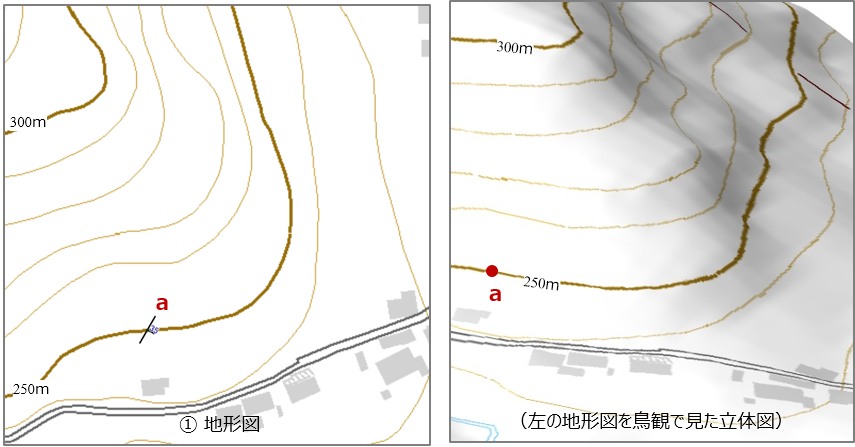
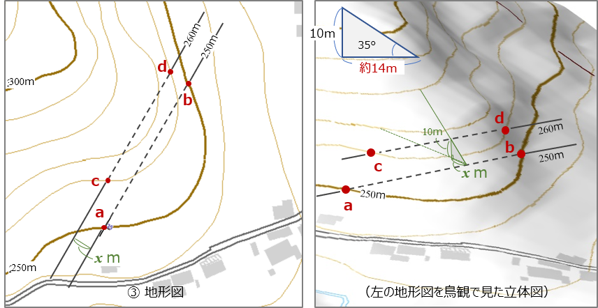
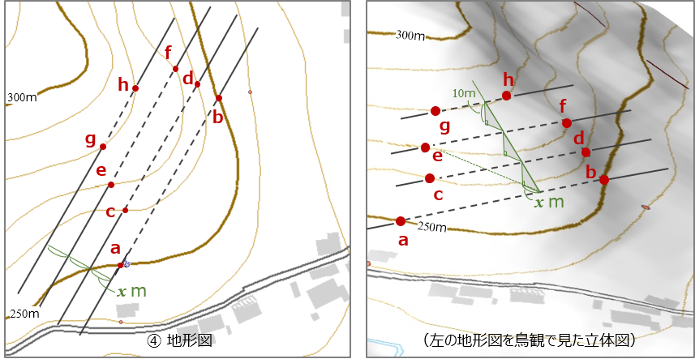
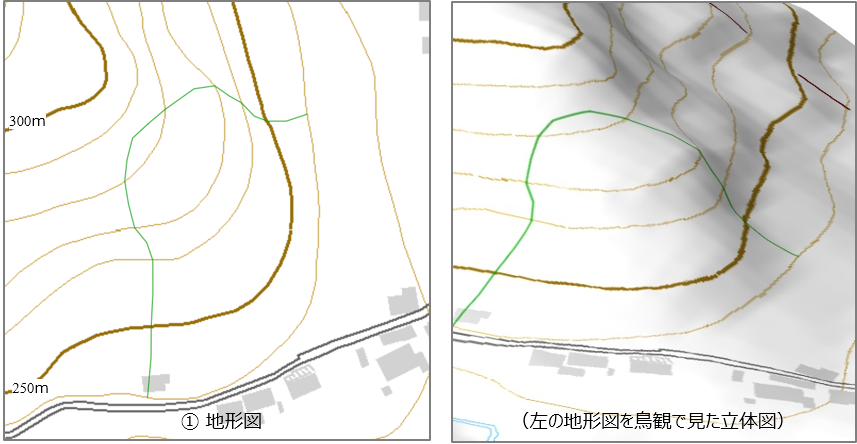

# 2-4. 地質図学（２）　地質境界線を描画する

地層が平面で分布していると仮定すると、前ページの傾斜角と標高の関係を利用して、地形図上での地層の境界線を引くことができます。  
以下にその手順を記します。

① 標高250ｍの地点aに地層の層理面が観察できる露頭があり、その走向は N30°E、傾斜は35°Eでした。この場合、地形図上は下の左図のように表記できます。

  
① 露頭の走向・傾斜を記録します  

② a地点から走向線を引き、標高250ｍの等高線と交わるて地点をbとします。すると、b地点にもa地点と同じ層理面があるはずです。

  
② a露頭の走向方向で同行度にある地表の点を見つけて走向線を引きます  

③ 次に、a-b の走向線に平行に、標高260ｍ に相当する走向線 c-d を引いてみましょう。 この場合、x は前項で解説したように、約14ｍ になります。

  
③ ②の走向線と平行に10ｍ高い標高（260ｍ）の走向線を引きます  

④ 走向線 c-d から、さらに標高270ｍ、標高280ｍ と、10ｍ ずつの走向線を平行して引いていきます。 そして、各々の走向線と同標高の等高線との交点をプロットします（地点e～h）。

  
④ 10ｍずつの走向線を引いていきます  

⑤ 地点 a から地点 h はすべて同じ層理面が現れます。 そこで、これらの地点を結んでいくと、その線が層理面が地表に現れる境界となります。

  
⑤ 同行度の等高線と走向線の交点をプロットします  

⑥ 完成した地層境界線は下図のようになります。

  
⑥ ⑤でプロットした点を結んでいくと、地表に現れる地層境界線を描画できます  

