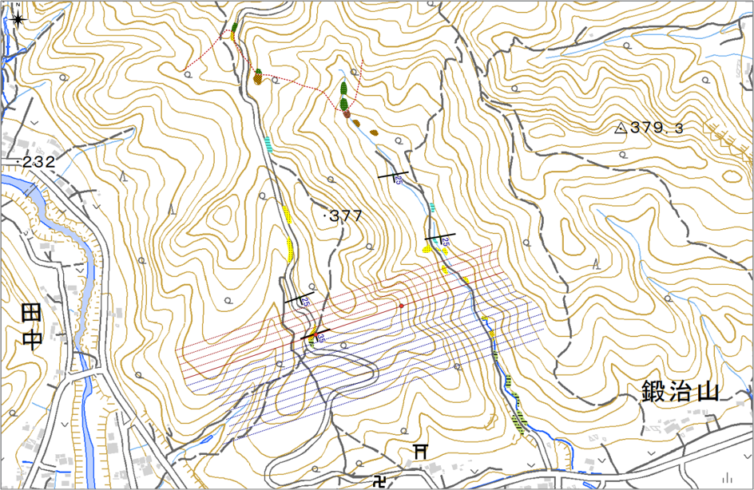
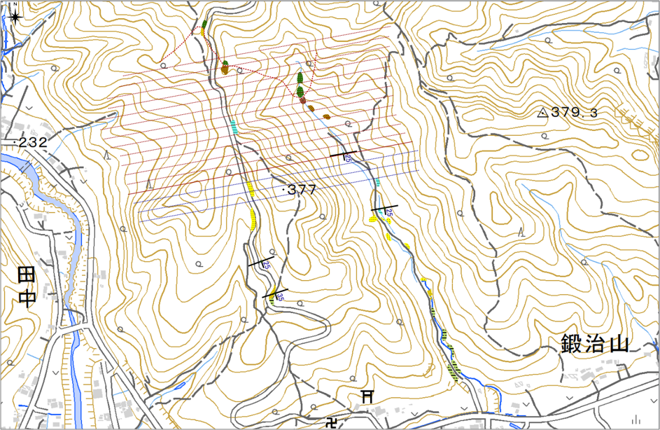
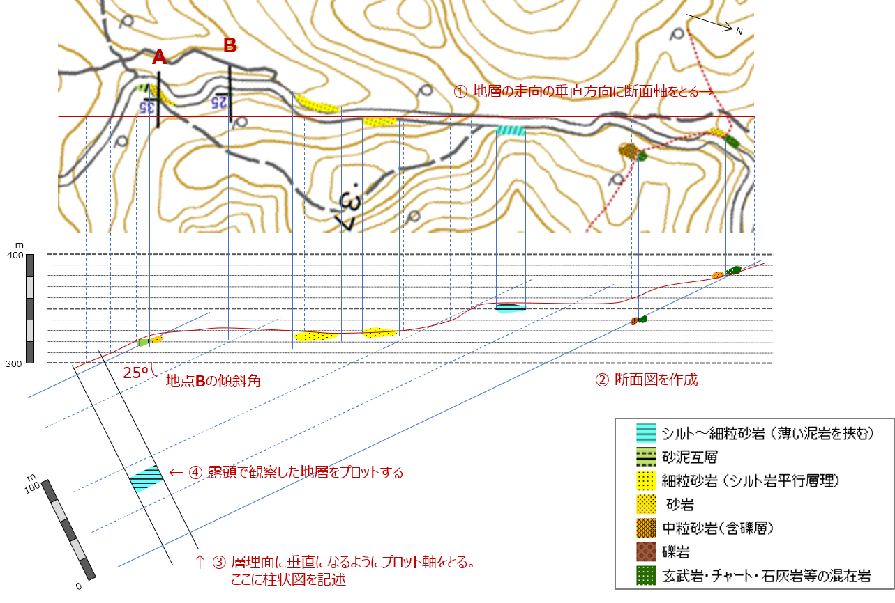

# 2-5. 演習用ワークシート

⇨ 下記の演習用ワークシートをPDFを表示（またはダウンロード）する場合は、[**こちら**](https://nsb-dank.github.io/GitBook/doc_02/演習_ワークシート.pdf) をクリック。

## ① 境界線作図用地図（１）

地点A（砂泥互層と砂岩の境界）の境界線を引く

## ② 境界線作図用地図（２）

地点B（砂岩と細粒砂岩の境界）の境界線を引く

## ③ 境界線作図用地図（３）

地点C（細粒砂岩とシルト岩の境界）の境界線を引く

## ④ 境界線作図用地図（４）

地点D（シルト岩と中粒砂岩の境界）の境界線を引く

## ⑤作図用地図

①～④で描いた境界線をこの地図に転写して、各地層面の色をつけて地質図を完成させましょう。

## ⑥ 柱状図を作成する（１）― 西側林道沿いルート ―

柱状図を作成するには、まず走向方向と垂直になるように断面図を書きます。 そして、傾斜角の分だけ傾けて（層理面と垂直となるように）プロット軸をとって、そこに露頭の地層を記入します。

## ⑦ 柱状図を作成する（２） ― 東側沢沿いルート ―

  

***  

[解答例](chapter02_6.md)  

