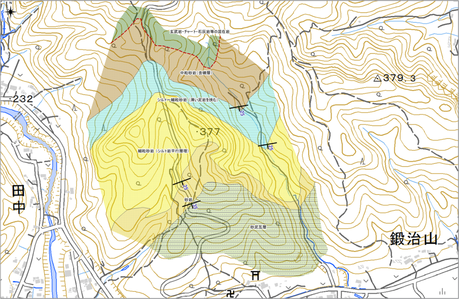
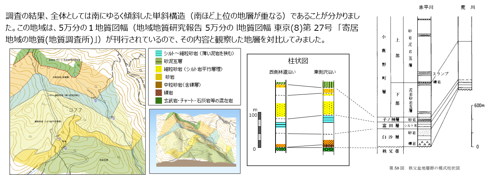
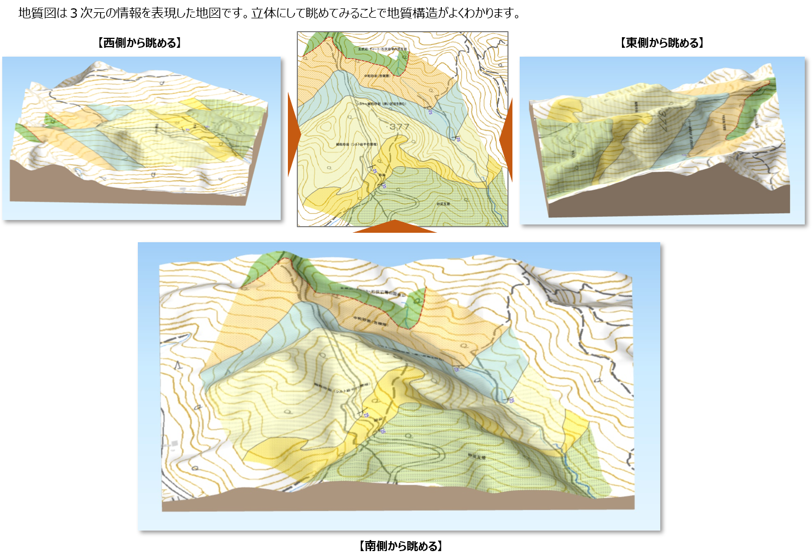

# 2-6. 解答例

⇨下記の解答例をPDFで表示（またはダウンロード）する場合は、[**こちら**](演習_解答例.pdf) をクリック。

## 境界線作図例

## 地質図作図例

## 断面図・柱状図

## 調査結果まとめ

調査の結果、全体としては南にゆるく傾斜した単斜構造（南ほど上位の地層が重なる）であることが分かりました。  
この地域は、5万分の１地質図幅（地域地質研究報告 5万分の l地質図幅 東京\(8\)第 27号 「寄居地域の地質\(地質調査所\)」）が刊行されているので、その内容と観察した地層を対比してみました。

## 立体図

[Webで表示した立体図](https://nsb-dank.github.io/books-seminar01/3d/3D.html)です。

